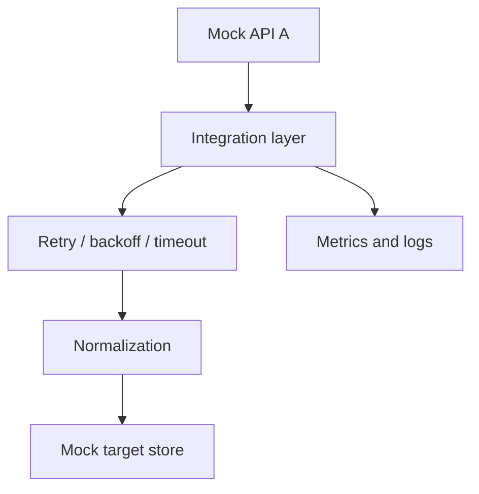

# API Integration Playground

[](https://github.com/guilherme-lacerda-tech/api-integration-playground/actions/workflows/ci.yml)

[](https://github.com/guilherme-lacerda-tech/api-integration-playground/releases)
[](LICENSE)

Synthetic REST integration lab focused on authentication, pagination, retry, backoff, timeout handling and normalization.

## Why / Problem

API integrations fail in ordinary ways: expired tokens, throttling, transient server errors and timeouts. This project demonstrates those behaviors with deterministic mock APIs instead of relying on unstable public services.

## Features

- Simulated authentication and token refresh.
- Paged source API.
- Retry with exponential backoff.
- Synthetic `HTTP 429`, `HTTP 500`, timeout and expired-token scenarios.
- Source payload normalization.
- In-memory target store.
- Cache reuse and integration metrics.
- CI with Ruff, PyTest and coverage.

## Architecture



## Tech Stack

Current: `Python` `REST patterns` `Retry` `Exponential backoff` `Pagination` `Cache` `Docker` `PyTest` `Ruff`

Planned: optional HTTP mock server and structured JSON logs.

## Quick Start

```powershell
python -m pip install -e ".[dev]"
python examples/run_demo.py
```

## Docker

```powershell
docker build -t api-integration-playground .
docker run --rm api-integration-playground
```

Docker runtime validation requires a local Docker CLI. In this workspace the Docker CLI was unavailable, so the Dockerfile was reviewed and the Python test/demo validation was executed separately.

## Tests

```powershell
python -m pytest --cov --cov-report=term-missing
python -m ruff check .
```

## Example Output

```text
Fetched records: 9
Normalized records: 9
Records written to target: 9
Retries handled: 3
Rate limits handled: 1
Timeouts handled: 1
Token refreshes: 3
```

## Project Structure

- `src/api_integration_playground/mock_api.py`: deterministic source API and failures.
- `src/api_integration_playground/client.py`: integration behavior, metrics and normalization.
- `examples/run_demo.py`: executable synthetic integration run.
- `tests`: retry, error, cache and target-store tests.

## Engineering Decisions

- Mock APIs keep failure scenarios repeatable.
- No real tokens or endpoints are required.
- Docker packages the demo command but no database is forced into the project.

## Roadmap

See [ROADMAP.md](ROADMAP.md).

## Security

All credentials, tokens and records are synthetic. This repository does not use private APIs, employer endpoints or real customer data.
