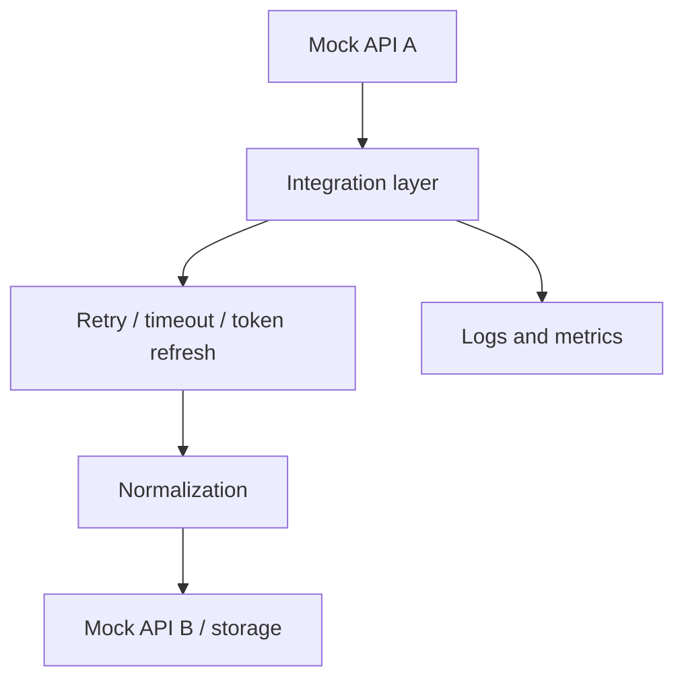

# API Integration Playground

Independent public portfolio project for **Python**, **REST integration patterns**, **automation** and **resilient client design**.

This repository was created from scratch with a fictional API and synthetic data. It does not contain corporate code, real data, private endpoints, credentials, logs or proprietary rules.

## Problem

API integrations must survive pagination, expiring tokens, throttling, transient errors and timeouts while keeping data normalization clear.

## What It Demonstrates

- Simulated authentication and token refresh.
- Pagination across a mock REST source.
- Retry with exponential backoff.
- Handling for `HTTP 429`, `HTTP 500`, timeout and expired token scenarios.
- Normalization from source payloads into target records.
- In-memory cache and integration metrics.
- Docker execution for the demo workflow.

## Architecture



See [docs/architecture.md](docs/architecture.md) for details.

## Stack

`Python` `REST patterns` `Retry` `Exponential backoff` `Pagination` `Cache` `Docker` `PyTest`

## Run Locally

```powershell
python examples/run_demo.py
```

## Run With Docker

```powershell
docker build -t api-integration-playground .
docker run --rm api-integration-playground
```

## Run Tests

```powershell
python -m pip install -e ".[dev]"
pytest
```

## Technical Decisions

- A mock API is used so every failure scenario is deterministic and safe to demonstrate.
- No external service is required because the purpose is the integration layer, not vendor-specific API usage.
- Docker is useful here because it packages the demo client as a reproducible command.

## Roadmap

- Add an optional HTTP mock server after the API design phase.
- Add structured JSON logs.
- Add persistence only when there is a real reason to retain integration runs.

## Security and Independence

See [SECURITY.md](SECURITY.md) and [DISCLAIMER.md](DISCLAIMER.md).
