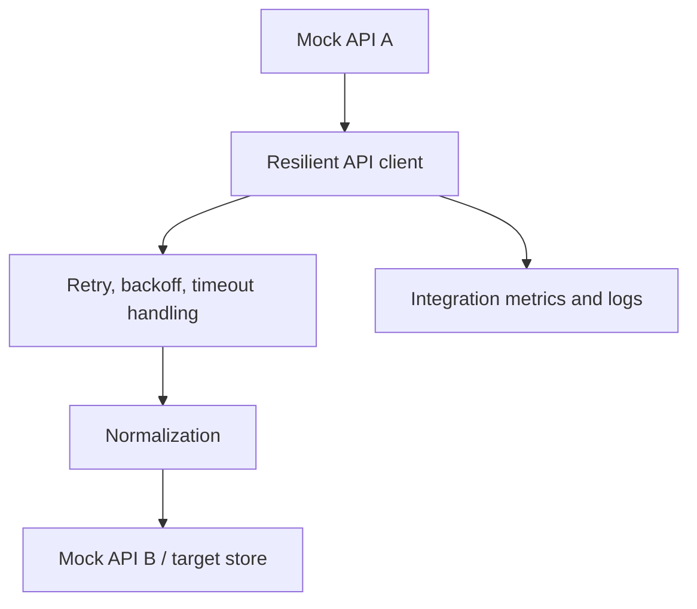

# Architecture

## Design Goal

Demonstrate integration behavior that is common in real REST environments while keeping every API, token and record synthetic.

## Flow

## Failure Scenarios

- `HTTP 429` rate limiting with retry-after behavior.
- `HTTP 500` transient server failure.
- Request timeout.
- Expired synthetic token with re-authentication.

## Boundaries

- No external API credentials are used.
- All tokens are generated in memory.
- The target store is synthetic and can be replaced by a database or API later.
